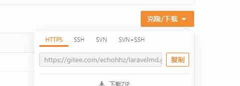

## 下载Git

[下载地址](https://git-scm.com/downloads)


## 工作区域

- Git仓库     最终确定的文件保存仓库  成为一个版本

- 暂存区      暂存已经修改的文件最后统一提交仓库

- 工作区      添加、编辑、修改文件...

  


## 初始化

#### 设置用户名

```
git config --global user.name 'githudName'
```


#### 设置邮箱

```
git config --gloabl user.eamil '2223616476@qq.com'
```


#### 查看用户名和邮箱

```
git config user.name
git config user.email
```


#### 查看其他配置

```
git config --list 
```


## 本地操作

1. 在本地创建和远程仓库文件一样的文件夹

2. 文件夹初始化，创建本地Git仓库

   ```
   git init
   ```

3. 文件夹里创建文件  使用命令

   ```
   touch name.后缀
   ```

4. 查询文件状态   （提交文件、修改文件 45678步骤）

   ```
   git status
   ```

5. 提交文件到本地缓存区

   ```
   git add file
   ```

6. 在查询状态，红色表示没有提交到缓存区的

7. 提交到本地仓库

   ```
   git commit -m '修改描述'
   ```

8. 在查询状态

9. 从git仓库里删除文件

   ```
   git rm filename
   ```

10. 提交删除

    ```
    git commit -m '描述'
    ```

    


## 远程仓库

#### 克隆

先把远程的文件克隆到本地 使用命令

```
git clone 仓库地址
```

获取仓库地址，可以直接在   点击复制ssh

	


#### 提交到远程仓库

`git add .`

`git commit -m '描述'`

`git status` 

`git push`   提交到远程仓库

`git add -A`   保存所有的修改 

`git add .`   保存新的添加和修改，但是不包括删除 

`git push` 之前先同步本地仓库和远程仓库的文件   `git pull origin master`


#### SSH公钥设置

需要将本地的git ssh公钥添加到gitee中

才能知道是谁的git 同步文件

ssh公钥 等于 自己git公开的密码


## git命令

`git status`    查看当前文件状态

`git add file`    提交到暂存区

`git commit -m "提交描述"`   提交到git仓库

`mkdir folder`   创建文件夹

`git rm filename`   从git删除文件


## Linux命令

`cat filename  ` 查看文件内容

`rm -rf filename`  删除文件  


