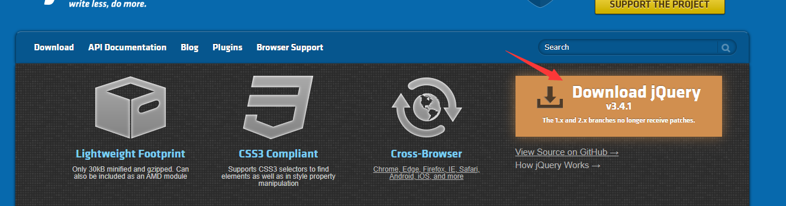
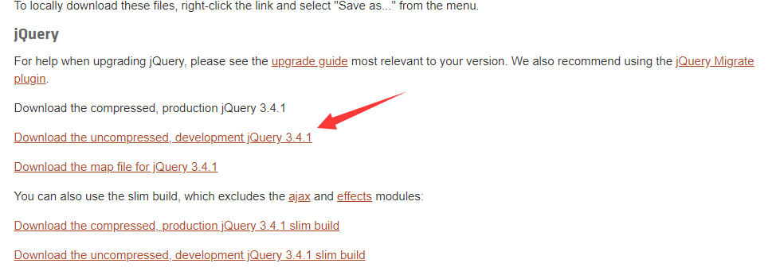

## jQuery的特点

1. 代码精致小巧
2. 强大的功能函数
3. 跨游览器
4. 链式的语法风格
5. 插件丰富


-----

<br>

## jQuery的 下载和配置

### jQuery的获取

#### 在[官网](https://jquery.com/)中下载



在首页点`Download jQuery` 进入下载页面



`Download the compressed`  是生产环境版 后缀`.min.js`

`Download the uncompressed`  是开发版 后缀`.js`

点击后出现源码，在将网页另存为  名字不用更改

<br>

`.js`和.`min.js`区别

|   区别   |       .js        |        .min.js         |
| :------: | :--------------: | :--------------------: |
|   版本   |      开发版      |       生成环境版       |
|   体积   |        大        |           小           |
|   语法   | 内容整齐语法清晰 | 语法紧凑把多余的删掉了 |
|   使用   |      不推荐      |          推荐          |
| 学习源码 |       推荐       |         不推荐         |

<br>

#### 命令行方式下载 

需要已经安装`node.js`

```
nmp install jquery
```

<br>

#### CDN方式

直接引用放在别人服务器上的`jq`文件

这个速度更快

使用直接复制`jq`包的网页地址

**没联网就无法使用**

<br>

### 版本介绍

- `jQuery 2.0` 以上版本是不兼容`IE8` 以及以下版本

<br>

### 引入方式

使用兼容版本方式 使用jQuery

实现不同版本`ie`加载不同`jQuery`

```html
<!-- chrome firefox safari opera ie9+ -->
<-- <![if gt IE8]> -->
<script scr="../jquery-3.3.1.min.js"></script>
<-- <![endif] -->

<!-- IE8以及一下 -->
<!-- <![if lte IE8]> 
<script scr="../jquery-3.3.1.min.js"></script>
<![endif] -->
```

使用标签判断

`IE8`  以及以下版本能识别都是注释的判断    `IE9+` 不能

`gt`  大于   `lte` 小于等于

这样会根据 `IE` 版本加载不同 `jQuery`包


----

<br>

## jQuery使用

先引入文件

```html
<script scr="https://code.jquery.com/jquery-3.4.1.min.js"></script>
```

写jQuery 入口文件

```html
<script type="text/javascript">
			// jQuery 入口
			$(document).ready(function(){
				
			})
			
			//jquery 入口简写
			$(function(){
				
			})
    
    		//原生js
    		window.onload = fnction(){
                
            }
</script>
```

写 jQuery 入口的作用

`ready`  的作用等到页面中的DOM元素加载完毕触发，才执行 `jq js` 代码  与 window.onload 差不多

`window.onload`   页面中的所有一切加载完才触发

`$(  )`  封闭作用域 ，避免全局变量污染  起到作用域独立

推荐将`jq`代码写在后面 避免页面加载堵塞


----

<br>

## jQuery插件

下载好插件

放在head标签里 在主jQuery源文件之后

流行插件

`jCarousel`插件  轮播图

`EasySlide` 插件 显示轮播图

`mb menu`  插件 导航二级菜单

...


