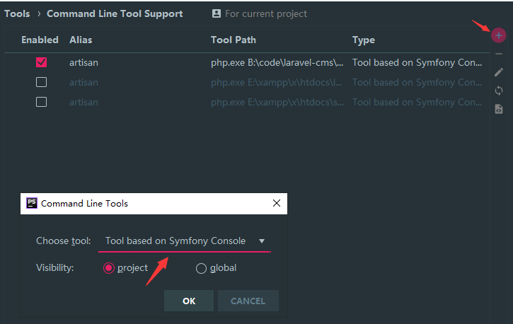
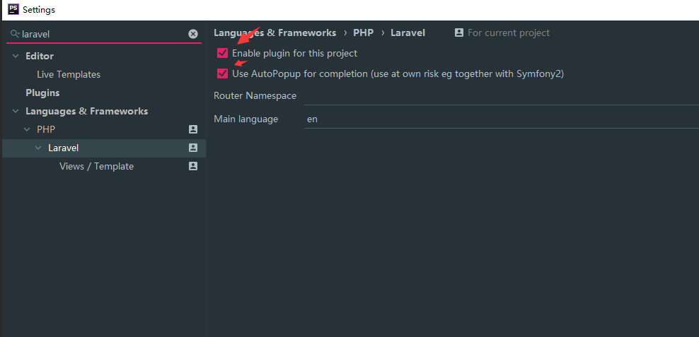

## 代码提示工具 

#### laravel-ide-helper 安装包 

```php
composer require barryvdh/laravel-ide-helper
```

在 「config/app.php」的 「providers」数组中加

```php
Barryvdh\LaravelIdeHelper\IdeHelperServiceProvider::class,
```

>  在命令行下 php artisan ide-helper:generate  生成代码跟踪支持


#### laravel artisan 命令提示

`settings>Tools>Command Line Tool Support`





刷新可以查询增加新的命令


#### phpstrom laravel插件提示


## Blade模板使用

#### 占位符

语法：

```
@yield('name')
```


#### 填充

语法：

```
@section('yield的name')
	定义片段
@show

@section('yield的name')
	填充占位
@endsection


@section('yield的name')
	@parent
	追加name的内容
@endsection	
```


#### 继承

语法：

```
@extends('模板名称')

@include('模板名称--父模板继承包含子模版')  
```


#### 组件


#### 流程控制

##### for

```
@for(...)
	{{}}
@endfor	
```


##### foreach

```
@foreach(...)
	{{}}
@endforeach	
```

带判断

```
@foreach($data as $k => $v)
	//$data有值
@empty
	//$data没有值
@endforeach	
```


##### if

```
@if()
	...
@else
	...
@endif	
```


##### while

```
@while()
	...
@endwhile	
```


##### php

使用原生PHP

```
@php
	echo ..;
@endphp
```


## laravel版本和包版本

laravel的版本要和包的版本匹配

不然无法下载


#### 解决办法

下载更低的版本，降低某这个组件的版本


#### 碰到一个错误

laravel6 中有`laravel-modules` 的有些方法没有完全更新

在这个链接中找到对应的源码进行替换

```
https://github.com/nWidart/laravel-modules/tree/master/src
```


## 数据库

#### 数据库字符串长度编辑

```php
<?php

namespace App\Providers;
use Illuminate\Support\Facades\Schema;
use Illuminate\Support\ServiceProvider;

class AppServiceProvider extends ServiceProvider
{
    /**
     * Register any application services.
     *
     * @return void
     */
    public function register()
    {
        //
    }

    /**
     * Bootstrap any application services.
     *
     * @return void
     */
    public function boot()
    {
        Schema::defaultStringLength(191);
    }
}

```


