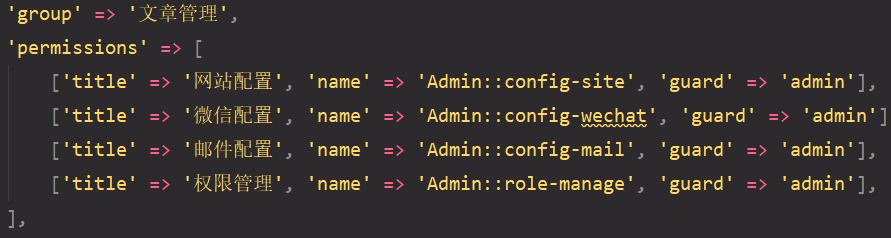
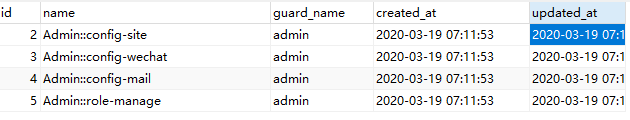
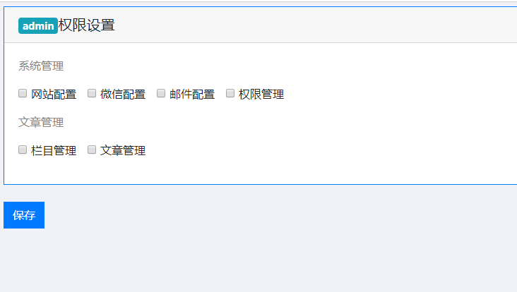
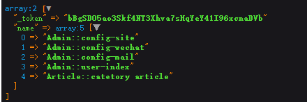
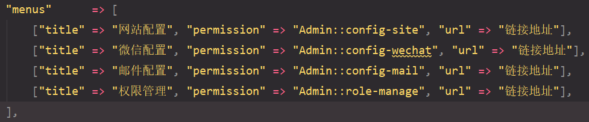

## 权限配置解析

权限文件在模块 `Config>permission.php` 里

`group`  是对这堆权限总的描述

`permissions` 是对每一条权限的配置

权限操作都是按照配置文件进行

<br>

`permission` 表中的 `guard_name` 字段  指的是`permissions`  数组中的  `'guard' => 'admin'`

`permission` 表中的 `name` 字段 指的是 权限名称

`'guard' => 'admin'` 是根据用户守卫者 进行验证权限

<br>

## 生成模块权限表

```
artisan hd:permission 模块名
```

不指定模块名 将全部模块都执行

将会把 `permission.php` 文件内容写进 `permission` 数据表

**permission表中的权限name 是唯一的** 

所以我们应该已 模块名::name 命名对应权限

```php
'name' => 'Admin::cateogry editor'
```

**避免重复权限名**



**我们修改了权限表，需要更新数据库中的权限表 是一一对应同步的**

所以在跑一遍命令

```
artisan hd:permission 模块名
```



需要和自己的权限配置文件一样

<br>

## 设置显示权限控制器

在RoleController控制器里，添加permission 显示设置权限的方法

```php
public function permission(Role $role)
{
      return view('admin:role.permission');
}
```

**需要依赖注入 Role**

<br>

## 设置权限显示路由

```php
Route::get('role/permission/{role}','RoleController@permission');
```

<br>

## 视图模板修改

将权限的按钮进行修改 设置成超链接

```html
<a href="/admin/role/permission/{{$role['id']}}">权限</a>
```

需要传参数 通过这个参数来找模型中id指定的记录

<br>

## 给视图分配变量

```php
public function permission(Role $role)
{
      //dd($role->toArray());	
      return view('admin::role.permission',compact('role'));
}
```

在视图中分配变量

{{$role->title}}

<br>

<br>

## Article模块权限配置

因为显示权限要把模块 都配置一下  这样才有足够多的演示权限

`Article>Config>permission.php`

```php
'permissions' => [
     ['title' => '栏目管理', 'name' => 'Article::catetory article', 'guard' => 'admin'],
     ['title' => '文章管理', 'name' => 'Article::content manage', 'guard' => 'admin'],
],
```

**需要执行生成数据表内容**

```
artisan hd:permission Article
```

homestead 环境是在虚拟机运行数据表相关的操作

<br>

<br>

## 输出各权限到页面

要把所有模块的permission权限都显示页面

通过以下调用可以获取admin配置文件所有信息

```php
\HDModule::getPermissionByGuard('admin');
```

返回的是一个数组，将它分配到视图中，渲染出所有权限

```php
public function permission(Role $role)
{
    $modules = \HDModule::getPermissionByGuard('admin');
    return view('admin::role.permission',compact('role','modules'));
}
```

<br>

**输出权限名称到页面**

```
@foreach($modules as $module)
    @foreach($module['rules'] as $rule)
    		{{$rule['group']}}    //一级菜单名
    	 @foreach($rule['permissions'] as $permission)
    	  {{$role->hasPermissionTo($permission['name'])?'checked=""':''}}
    	  //判断是否已经有该权限
    	  value="{{$permission['name']}}"  //权限名
    	  {{$permission['title']}}   //二级菜单名
    	 @endforeach
    @endforeach	 
@endforeach    
```



设置多一个组 会员管理

```php
[
        'group' => '会员管理',
        'permissions' => [
            ['title' => '会员列表', 'name' => 'Admin::user-index', 'guard' => 'admin'],
            ['title' => '编辑会员', 'name' => 'Admin::user-edit', 'guard' => 'admin'],
        ],
],
```

**需要执行命令 让权限表生成相应数据**

```
artisan hd:permission Admin
```

**读取是按配置文件**

**实际应用是按权限表中的数据**

<br>

## 增加路由

```php
Route::post('role/permission/{role}','RoleController@permissionStore');
```

由于提交类型不一样，所以`url`一样无所谓

用来提交设置权限

设置视图提交表单`url`

```
/admin/role/permission/{{$role['id']}}
```

设置复选框 name为 name[]



## 设置控制器

使用同步关联到角色权限表中去

```php
public function permissionStore(Request $request,Role $role)
{
//    dd($request->all());
      $role->syncPermissions($request->name);
      session()->flash('success','权限设置成功');
      return back();
}
```

<br>

**设置权限已经拥有 状态时已勾选**

`$role->hasPermission()` 判断用户是否拥有权限

`$permission['name']`  权限标识

`checked=""`   已勾选

```
{{$role->hasPermission($permission['name']) ? 'checked=""':''}}
```

<br>

<br>

## 菜单栏权限判断

自定义创建一个角色出来

在根目录下的`seeds>AdminSeeder` 里编写

```php
\Spatie\Permission\Models\Role::create([
      'title' => '管理员',
      'name' => 'admin',
      ’guard_name' => 'admin'
]);
```

然后执行迁移文件 数据填充

```
artisan migrate:refresh --seed
```

<br>

## 分配初始管理员

`seeds>AdminSeeder` 里增加

```
$user->assignRole('admin');
```

**模型本身没有这个方法**

需要添加

在`Admin`模型中引入这个类

```php
use Spatie\Permission\Traits\HasRoles;
class Admin extends Authenticatable
{
    use Notifiable,HasRoles;

}
```

增加赋予权限的功能

然后在执行数据迁移填充

```
artisan migrate:refesh --seed
```


需要跑一下权限配置

```
artisan hd:permission Admin
```

<br>

<br>

## 使用权限控制后台菜单显示

 `menus.php` 的菜单配置文件 

将权限标识，改成`permission`中的`name`



在`menus.blade.php` 菜单视图中进行设置

加权限配置

使用 `can` 判断能不能搞这个事情

```
@can($menu['permission'])
<li><i class="fa fa-asterisk"></i><a href="{{$menu['url']}}">{{$menu['title']}}</a></li>
@endcan
```

 然后点击权限分配，有这权限菜单就能显示

`munus.php` 菜单文件 要和 `permission.php` 权限文件 相匹配


